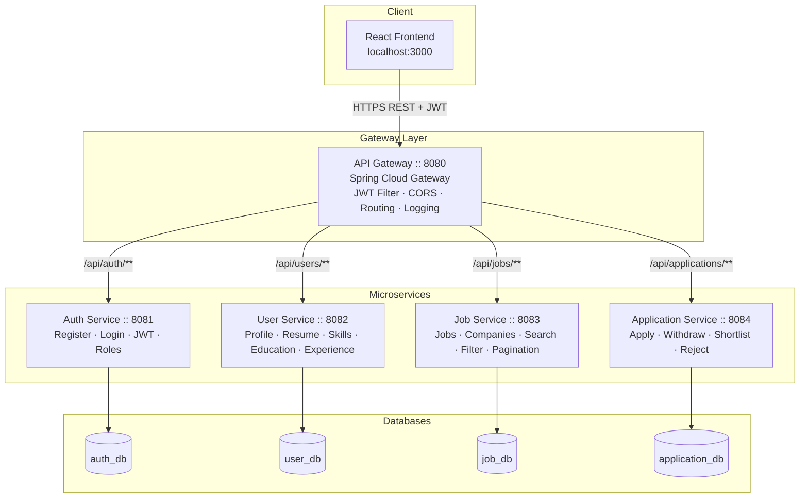
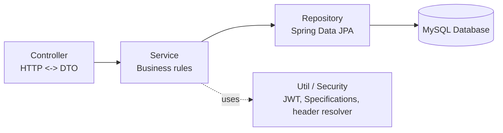

# Architecture Diagram

## High-Level Component Diagram

## Key Points

- **Single entry point:** the frontend never talks to a microservice directly — every request goes through the Gateway.
- **No inter-service calls:** Job Service, User Service, and Application Service never call each other. Any cross-domain data the frontend needs (e.g. "who is this applicant") is fetched by the frontend making a separate call to the relevant service through the Gateway.
- **Static routing:** the Gateway routes by URL path prefix to a fixed `http://localhost:PORT` — no service discovery (Eureka) is used, per project constraints.
- **Security boundary:** JWT signature/expiry is verified exactly once, at the Gateway. Downstream services trust the `X-User-Id` / `X-User-Name` / `X-User-Role` headers the Gateway injects.
- **Database-per-service:** each service has exclusive ownership of its schema; there are no foreign keys across databases, only logical `Long` id references.

## Layered Architecture (inside every microservice)

Controllers never contain business logic; they validate input (`@Valid`), call the service, and wrap the result in a standard `ApiResponse` envelope with the correct HTTP status.
