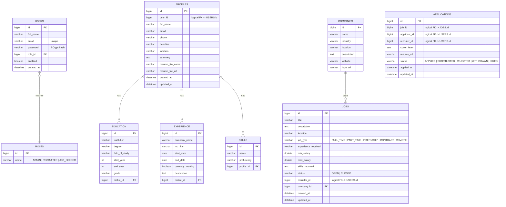

# Entity Relationship Diagram

JobOrbit uses **4 independent MySQL databases** (one per microservice). There are no cross-database foreign keys — relationships between databases are logical (`Long` id values), shown below as dashed lines.

## Cross-database logical relationships

| From (table.column) | Database | To (table.column) | Database | Enforced by |
|---|---|---|---|---|
| `profiles.user_id` | user_db | `users.id` | auth_db | application logic (User Service reads `X-User-Id` header) |
| `jobs.recruiter_id` | job_db | `users.id` | auth_db | application logic (Job Service reads `X-User-Id` header) |
| `applications.job_id` | application_db | `jobs.id` | job_db | application logic |
| `applications.applicant_id` | application_db | `users.id` | auth_db | application logic |
| `applications.recruiter_id` | application_db | `users.id` | auth_db | application logic |

There is a unique constraint on `applications (job_id, applicant_id)` so a job seeker cannot apply to the same job twice.
