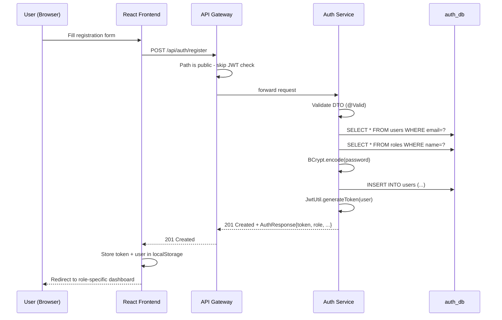
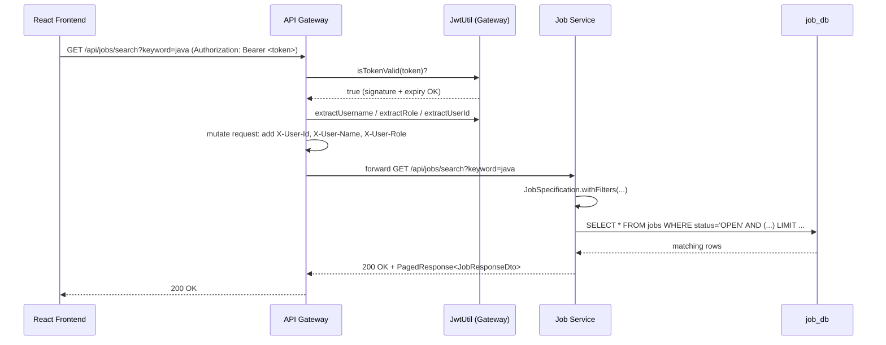
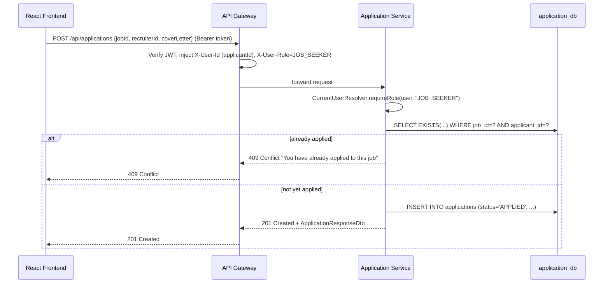
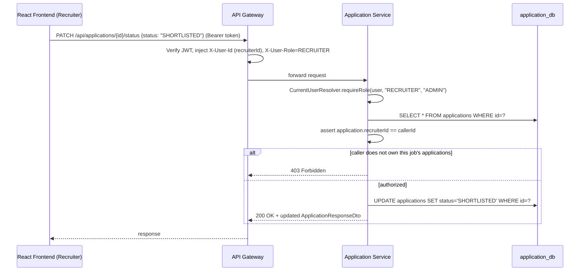

# Sequence Diagrams

## 1. Registration & Login

```mermaid
sequenceDiagram
    participant U as User (Browser)
    participant FE as React Frontend
    participant GW as API Gateway
    participant AUTH as Auth Service
    participant DB as auth_db

    U->>FE: Fill registration form
    FE->>GW: POST /api/auth/register
    GW->>GW: Path is public - skip JWT check
    GW->>AUTH: forward request
    AUTH->>AUTH: Validate DTO (@Valid)
    AUTH->>DB: SELECT * FROM users WHERE email=?
    AUTH->>DB: SELECT * FROM roles WHERE name=?
    AUTH->>AUTH: BCrypt.encode(password)
    AUTH->>DB: INSERT INTO users (...)
    AUTH->>AUTH: JwtUtil.generateToken(user)
    AUTH-->>GW: 201 Created + AuthResponse{token, role, ...}
    GW-->>FE: 201 Created
    FE->>FE: Store token + user in localStorage
    FE-->>U: Redirect to role-specific dashboard
```

## 2. Authenticated Request (e.g. Job Seeker searches jobs)

```mermaid
sequenceDiagram
    participant FE as React Frontend
    participant GW as API Gateway
    participant JWT as JwtUtil (Gateway)
    participant JOB as Job Service
    participant DB as job_db

    FE->>GW: GET /api/jobs/search?keyword=java (Authorization: Bearer <token>)
    GW->>JWT: isTokenValid(token)?
    JWT-->>GW: true (signature + expiry OK)
    GW->>JWT: extractUsername / extractRole / extractUserId
    GW->>GW: mutate request: add X-User-Id, X-User-Name, X-User-Role
    GW->>JOB: forward GET /api/jobs/search?keyword=java
    JOB->>JOB: JobSpecification.withFilters(...)
    JOB->>DB: SELECT * FROM jobs WHERE status='OPEN' AND (...) LIMIT ...
    DB-->>JOB: matching rows
    JOB-->>GW: 200 OK + PagedResponse<JobResponseDto>
    GW-->>FE: 200 OK
```

## 3. Apply to a Job

```mermaid
sequenceDiagram
    participant FE as React Frontend
    participant GW as API Gateway
    participant APP as Application Service
    participant DB as application_db

    FE->>GW: POST /api/applications {jobId, recruiterId, coverLetter} (Bearer token)
    GW->>GW: Verify JWT, inject X-User-Id (applicantId), X-User-Role=JOB_SEEKER
    GW->>APP: forward request
    APP->>APP: CurrentUserResolver.requireRole(user, "JOB_SEEKER")
    APP->>DB: SELECT EXISTS(...) WHERE job_id=? AND applicant_id=?
    alt already applied
        APP-->>GW: 409 Conflict "You have already applied to this job"
        GW-->>FE: 409 Conflict
    else not yet applied
        APP->>DB: INSERT INTO applications (status='APPLIED', ...)
        APP-->>GW: 201 Created + ApplicationResponseDto
        GW-->>FE: 201 Created
    end
```

## 4. Recruiter Shortlists a Candidate

```mermaid
sequenceDiagram
    participant FE as React Frontend (Recruiter)
    participant GW as API Gateway
    participant APP as Application Service
    participant DB as application_db

    FE->>GW: PATCH /api/applications/{id}/status {status: "SHORTLISTED"} (Bearer token)
    GW->>GW: Verify JWT, inject X-User-Id (recruiterId), X-User-Role=RECRUITER
    GW->>APP: forward request
    APP->>APP: CurrentUserResolver.requireRole(user, "RECRUITER", "ADMIN")
    APP->>DB: SELECT * FROM applications WHERE id=?
    APP->>APP: assert application.recruiterId == callerId
    alt caller does not own this job's applications
        APP-->>GW: 403 Forbidden
    else authorized
        APP->>DB: UPDATE applications SET status='SHORTLISTED' WHERE id=?
        APP-->>GW: 200 OK + updated ApplicationResponseDto
    end
    GW-->>FE: response
```
